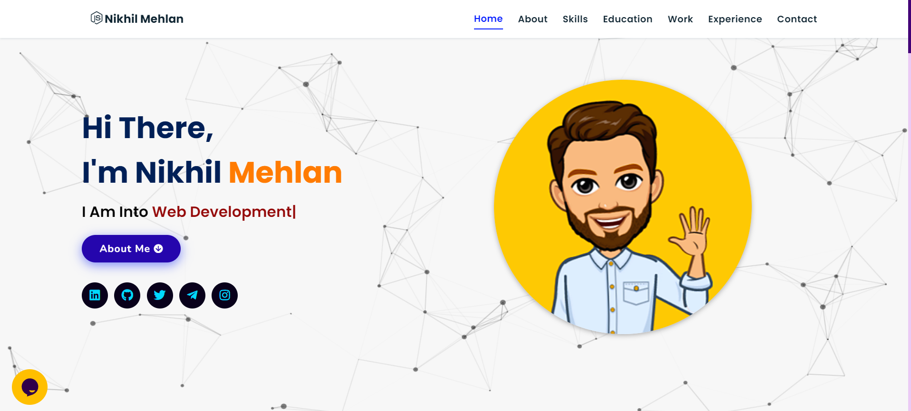

# Software Developer Portfolio

Welcome to my software developer portfolio! This repository showcases a variety of projects and software solutions that demonstrate my skills in full-stack development, problem-solving, and creative thinking.



## Table of Contents

- [About](#about)
- [Technologies](#technologies)
- [Setup](#setup)
- [Contact](#contact)

## About

This portfolio is a collection of my work as a software developer, highlighting my expertise in creating high-quality, efficient, and innovative software solutions. Each showcase item included here reflects my dedication to continuous learning and my passion for technology.


## Technologies

This portfolio includes work developed using a variety of technologies, including but not limited to:

- Frontend: HTML, CSS, JavaScript,Jquery
- Backend: Node.js, Express
- Databases:  MongoDB
- Tools: Git

## Setup

To run any of the showcase items locally, follow these general steps:

1. Clone the repository:
    ```bash
    git clone https://github.com/your-username/your-portfolio-repo.git
    ```

2. Navigate to the item directory:
    ```bash
    cd your-portfolio-repo/item-directory
    ```

3. Install the necessary dependencies:
    ```bash
    npm install  # or yarn install
    ```

4. Start the development server:
    ```bash
    npm start  # or yarn start
    ```

5. Open your browser and visit `http://localhost:3000` to see the item in action.

*(Adjust the setup instructions based on your work's requirements)*

## Contact

Feel free to reach out to me for any inquiries, collaborations, or just to say hello!

- **Email**: nikhilmehlan1234@example.com
- **LinkedIn**: [Nikhil Mehlan](https://www.linkedin.com/in/nikhil-mehlan-90aa12253)
- **GitHub**: [Nikhil Mehlan](https://github.com/nikhilmehlan)

Thank you for visiting my portfolio! Feel free o give a ⭐!!
